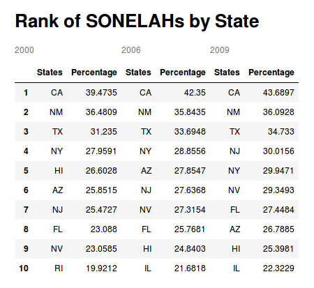
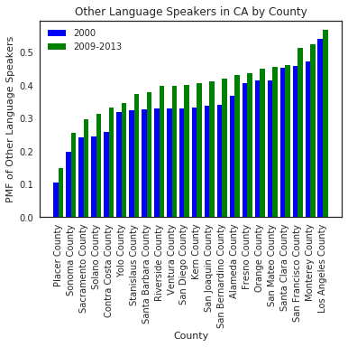
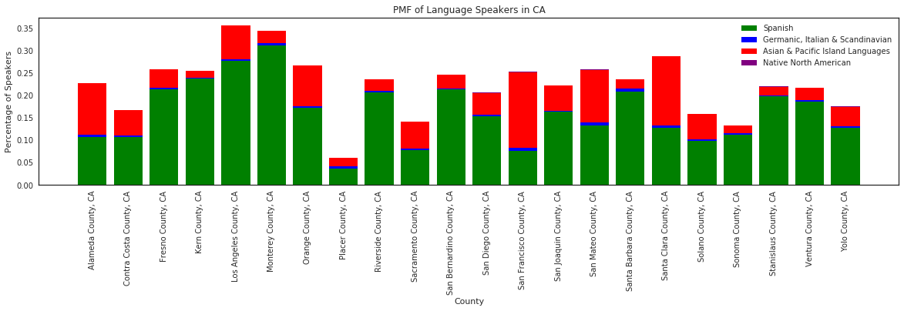
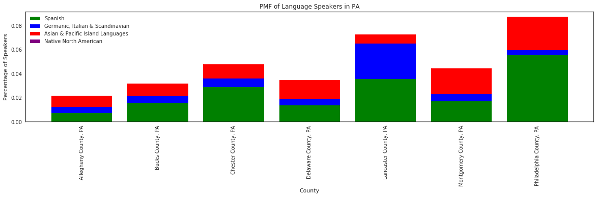

# What is the Mother Tongue of U.S. Communities?

By watching the news, a person can assume that diversity is increasing rapidly in the United States. While the Census has praised the U.S. for becoming overall more racial and ethnically diverse, FOX newscaster Tucker Carlson has claimed that the rise of immigrants in the U.S. is not happening in "politicians' neighborhoods" and that the increase of racial and cultural groups from non-western countries is changing the culture in American towns to an unprecedented and unmanageable degree. (See Project Proposal)

We wanted to take these two clashing statements and put them both to the test. Has cultural diversity, measured through linguistic diversity, increased significantly in the past few years? How is cultural diversity, through linguistic diversity, spread out throughout the U.S.? Are regions with high ratios of non-English speakers actually linguistically diverse or homogeneously consisting of a non-English speaking community?

In the U.S., citizens are required to answer the Census, including the questions: "Does this person speak a language other than English at home?" and "What is this language?" The Census then conglomerates this data into a dataset, which contains over 380 languages and the corresponding number of respondents which speak them. We looked at three of these datasets: a 2000 dataset, a dataset of accumulated data from 2006 to 2008 and a dataset of accumulated data from 2009 to 2013. From here, we will refer to speakers of non-English languages at home as SONELAHs  and speakers of only English as SOE.

Armed with this Census data about languages spoken at home, we decided to investigate Tucker Carlson's claim...

We started by creating two tables that shows the temporal and spatial changes of linguistic diversity at the state level. The first table shows the ten states with the greatest percentage of SONELAHs and the second table shows the ten states with the smallest percentage of SONELAHs.

  

California consistently has the highest percent of SONELAHs. We attributed this to a few different reasons. California previously belonging to Mexico means that there possibly is a higher percentage of Spanish speakers. California being a coastal state that contains many large cities means that it has a lot of places that are practical for an immigrant to come to when immigrating. Similarly, for New Mexico and Texas, which consistently are ranked second and third, we assume that there is Latin heritage is prevalent, due to the regions being once part of Mexico. The table informs us that the highest percentage of SONELAHs in any state has gone from 39 percent to 43 percent in 13 years. The change is not large, but it does show that there are areas with a very large number of SONELAHs.

Also note that New York, which contains New York City - a place that is synonymous with immigration- is ranked fourth in 2000 and 2006-2008. In the 2009 to 2013 period, it loses its fourth place spot to New Jersey, which has been increasing in rank for every period.

West Virginia has the lowest number of SONELAHs and has consistently stayed at about 2 percent for the entire range of time we are analyzing. This is interesting because West Virginia is a very small state which means that the number of SONELAHs within the state must be very small, especially in comparison to most of the other states in the country.

Looking at the state level, however, does not tell us a lot about communities. Looking at the county level, we can infer what a community might look like.

Only our 2000 and 2009-2013 data sets have data on counties. Therefore, we used these two datasets to plot change in the PMF of SONELAHs per county in California.

  

Los Angeles has the largest population, and thus, the largest number of SONELAHs. However, Los Angeles is a major city in a geographically large state. We see that the distribution of percentage of SONELAHs is more widely spread with so many different places to sample. For example, Los Angeles has the most SONELAHs, at more than 50 % of the population, while Placer County has only about 10 % of its population consist of SONELAHs. That is like every other person being a SONELAH to every tenth person being a SONELAH.

We want to also know if these people represent one culture, or many cultures. One way of looking at this is to abstract a few languages into groups, and see what percentage of the total population falls into these groups. The groups which we picked were :'Spanish and Creole', 'German, Italian and Scandinavian', 'Asian and Pacific Island Languages' and 'Native North American Languages'. Although this list is by no means inclusive, it is simple and the groups are fairly different from one another.
We graphed the counties of California again, this time showing the percentages of SONELAHs in these language groups.  

  

We see a large population of Spanish and Asian language SONELAHs. This is a result that we do not find surprising, considering the history of Asian immigration to California and the Latin heritage of a state that was formerly part of Mexico.

San Francisco, which has a high percentage of Asian and Pacific Island languages, has the second highest population of Chinese-Americans in the U.S., and yet the percentage of Asian and Pacific Island language SONELAHs in the county is only around 15 %. This means that the most culturally concentrated, only about every seventh person is an Asian and Pacific Island language SONELAH. Although it may be difficult to see, there are a few counties with SONELAHs that speak Native North American languages such as San Fransisco, San Mateo, and Stanislaus. These bars are so small because less than 1 percent of the population speaks them. This is not abnormal because a large number of Native North American languages are slowly fading away due to the effects of colonization.

Looking at the linguistic make-up of the state with the highest percentage of non-English speakers, we wondered if a state with a low percentage of non-English speakers would look similar or different.

We graphed the PMF of the four language groups we have chosen.

  

We can immediately spot a difference between California and Pennsylvania in Lancaster County which is known as a Pennsylvania Dutch county. Pennsylvania Dutch is a unique dialect of German that originated in Pennsylvania, which explains why there is a particularly high number of European languages within that county. Although Pennsylvania Dutch originated within the state there is still only a small number of speakers, some fraction of the five percent of European Language speakers in Lancaster, which speaks to how surprising it is how prevalent Spanish is within the state. The majority of SONELAHs do not speak Spanish within every county, but they make up the largest number of SONELAHs within the state. Also in similar fashion to California, the urban centers of Pennsylvania have the largest percentage of SONELAHs as shown by Philadelphia.

After analyzing the sets of data we can come to some conclusions about the cultural diversity within America. It is clear to see that there has been an increase in the number of SONELAHs in recent years and that they are not always a small part of the population with California have 43 percent in 2013. However, we can say with certainty that the number of SONELAHs is not growing very rapidly. Even New Jersey only gained 5 percent more SONELAHs in between 2000 and 2013, and it had moved from have the 7th to the 4th highest number of SONELAHs in the country. Even if you look individually by county, it is rare to see anything above a 5 percent increase. The majority of SONELAHs are located in the southwestern United States or in large populated cities especially along the east coast. This is not an uncommon trend as immigrants have historically flocked to cities for numerous socio-economic reasons. Finally, America is not homogeneous and most of the states aren't either. Although Spanish is widely spoken there is not a clear indicator that any particular language group completely dominates the others.

We have shown that the Census Bureau has made a fair state. The United States has been becoming more and more culturally diverse as the years have passed. Tucker Carlson, on the other hand, has mistakenly come to the conclusion that we are growing at an incredibly fast rate. Although there are places with extremely high numbers of SONELAHs like California, which has 43 percent of its population made up of SONELAHs in 2013, this does not necessarily mean a drastic change as in 2000 39 percent of its population was made of SONELAHs. As diversity and the overall population increases, our expectations for what our neighborhoods will look like may be broken, but it does not mean that there has actually been a drastic change in the culture and makeup of our country.
